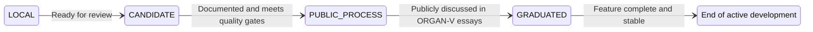
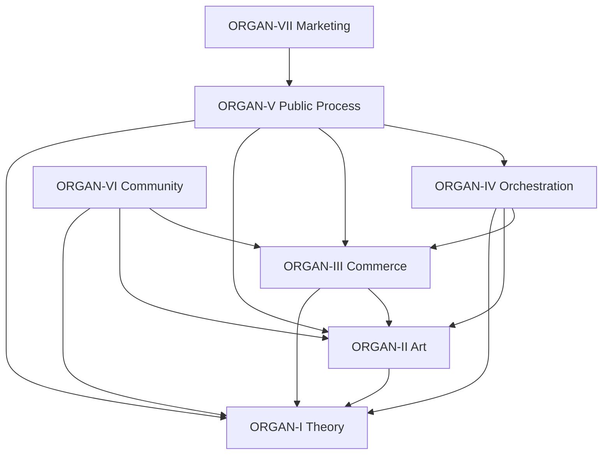

-4A90D9?style=for-the-badge)   

# orchestration-start-here

[](https://github.com/organvm-iv-taxis/orchestration-start-here/actions/workflows/ci.yml)
[](https://github.com/organvm-iv-taxis/orchestration-start-here)
[](https://github.com/organvm-iv-taxis/orchestration-start-here/blob/main/LICENSE)
[](https://github.com/organvm-iv-taxis)
[](https://github.com/organvm-iv-taxis/orchestration-start-here)
[](https://github.com/organvm-iv-taxis/orchestration-start-here)


**The central nervous system of an eight-organ creative-institutional architecture.** This repository is the single coordination point for 171 repositories distributed across 8 GitHub organizations, enforcing governance rules, validating cross-organ dependencies, running monthly system-wide health audits, and automating the promotion pipeline that moves work from theoretical research through artistic expression into commercial products. Everything in this system — every README deployed, every dependency validated, every essay published — flows through the data structures and automation pipelines defined here.

---

## Table of Contents

- [Architectural Overview](#architectural-overview)
- [The Eight-Organ Model](#the-eight-organ-model)
- [Registry Documentation](#registry-documentation)
- [Governance Model](#governance-model)
- [GitHub Actions Workflows](#github-actions-workflows)
- [Python Validation Scripts](#python-validation-scripts)
- [Cross-Organ Dependency Map](#cross-organ-dependency-map)
- [Portfolio Positioning](#portfolio-positioning)
- [Quick Start](#quick-start)
- [Contributing](#contributing)
- [System Map](#system-map)
- [Related Resources](#related-resources)

---

## Architectural Overview

The organvm system organizes creative and institutional work into eight organs — discrete functional domains, each with its own GitHub organization, repository constellation, and operational mandate. The architecture draws from biological systems: organs are specialized but interdependent, and the system's health depends on coordination between them rather than any single organ's output.

**Why eight organs?** The division mirrors the lifecycle of ideas in creative-institutional practice. Theoretical research (ORGAN-I) generates conceptual frameworks. Artistic practice (ORGAN-II) transforms those frameworks into experiential work. Commerce (ORGAN-III) packages that work for economic sustainability. The remaining five organs handle orchestration, public documentation, community, marketing, and meta-coordination — the connective tissue that makes the system function as a coherent whole rather than a collection of disconnected projects.

**Why parallel launch?** Traditional project launches are sequential: build, then document, then ship. This system launched all eight organs simultaneously to demonstrate integrated systems thinking. A grant reviewer or hiring manager seeing one organ can follow dependency links to discover the entire architecture. The parallel approach also prevents the common failure mode of launching a single polished project while the supporting infrastructure remains invisible.

**How this hub coordinates everything.** `orchestration-start-here` is the only repository that has read/write awareness of the entire system. It holds the canonical registry of all repositories, the governance rules that constrain how work flows between organs, and the automation workflows that enforce those constraints. When a developer opens a pull request in any organ, the `validate-dependencies` workflow fetches the registry from this hub to check for violations. When the monthly audit runs, it reads the registry and governance rules from this hub to produce a system-wide health report. The hub is the source of truth; individual organs are the locus of work.

```
                        ┌──────────────────────────────┐
                        │   orchestration-start-here    │
                        │                              │
                        │  registry.json               │
                        │  governance-rules.json       │
                        │  5 workflows · 3 scripts     │
                        └──────────┬───────────────────┘
                                   │
              ┌────────────────────┼────────────────────┐
              │                    │                     │
     ┌────────▼──────┐  ┌─────────▼────────┐  ┌────────▼──────┐
     │   ORGAN-I     │  │    ORGAN-II      │  │   ORGAN-III   │
     │   Theory      │──▶    Art           │──▶   Commerce    │
     │   18 repos    │  │    22 repos      │  │   21 repos    │
     └───────────────┘  └──────────────────┘  └───────────────┘
              │                    │                     │
     ┌────────▼──────┐  ┌─────────▼────────┐  ┌────────▼──────┐
     │   ORGAN-V     │  │    ORGAN-VI      │  │   ORGAN-VII   │
     │   Process     │  │    Community     │  │   Marketing   │
     │   2 repos     │  │    3 repos       │  │   4 repos     │
     └───────────────┘  └──────────────────┘  └───────────────┘
                                   │
                        ┌──────────▼───────────────────┐
                        │       meta-organvm           │
                        │       (Umbrella Org)         │
                        └──────────────────────────────┘
```

---

## The Eight-Organ Model

| # | Organ | Domain | GitHub Organization | Repos | Flagship |
|---|-------|--------|-------------------|-------|----------|
| I | Theoria | Theory — epistemology, recursion, ontology | [organvm-i-theoria](https://github.com/organvm-i-theoria) | 18 | [recursive-engine--generative-entity](https://github.com/organvm-i-theoria/recursive-engine--generative-entity) |
| II | Poiesis | Art — generative, performance, experiential | [organvm-ii-poiesis](https://github.com/organvm-ii-poiesis) | 22 | [metasystem-master](https://github.com/organvm-ii-poiesis/metasystem-master) |
| III | Ergon | Commerce — SaaS, B2B, B2C products | [organvm-iii-ergon](https://github.com/organvm-iii-ergon) | 21 | [public-record-data-scrapper](https://github.com/organvm-iii-ergon/public-record-data-scrapper) |
| IV | Taxis | Orchestration — governance, routing, validation | [organvm-iv-taxis](https://github.com/organvm-iv-taxis) | 9 | **this repository** |
| V | Logos | Public Process — essays, building in public | [organvm-v-logos](https://github.com/organvm-v-logos) | 2 | [public-process](https://github.com/organvm-v-logos/public-process) |
| VI | Koinonia | Community — salons, reading groups | [organvm-vi-koinonia](https://github.com/organvm-vi-koinonia) | 3 | org profile |
| VII | Kerygma | Marketing — POSSE distribution, announcements | [organvm-vii-kerygma](https://github.com/organvm-vii-kerygma) | 4 | org profile |
| VIII | Meta | Umbrella — cross-organ coordination | [meta-organvm](https://github.com/organvm) | 1 | org profile |

The Greek suffix naming convention (Theoria, Poiesis, Ergon, Taxis, Logos, Koinonia, Kerygma) is drawn from Aristotelian categories of knowledge and action. Each name maps to the organ's function: *theoria* for contemplative knowledge, *poiesis* for creative making, *ergon* for productive work, *taxis* for ordering and arrangement.

---

## Registry Documentation

The `registry.json` file is the single source of truth for the entire system. Every repository's status, dependencies, documentation state, promotion status, and portfolio relevance is tracked here. If the registry and reality disagree, either the registry must be updated or reality must be fixed — this is Article I of the system constitution.

### Schema

Each repository entry contains the following fields:

| Field | Type | Description |
|-------|------|-------------|
| `name` | string | Repository name (without org prefix) |
| `org` | string | GitHub organization (e.g., `organvm-i-theoria`) |
| `status` | enum | `ACTIVE`, `ARCHIVED`, `PLANNED` |
| `public` | boolean | Whether the repository is publicly visible |
| `description` | string | Human-readable description (synced to GitHub) |
| `documentation_status` | enum | `DEPLOYED`, `FLAGSHIP README DEPLOYED`, `INFRASTRUCTURE`, `EMPTY`, `SKELETON` |
| `portfolio_relevance` | enum | `CRITICAL`, `HIGH`, `MEDIUM`, `LOW`, `INTERNAL` |
| `dependencies` | array | List of `org/repo` strings this repo depends on |
| `promotion_status` | enum | `LOCAL`, `CANDIDATE`, `PUBLIC_PROCESS`, `GRADUATED`, `ARCHIVED` |
| `tier` | enum | `flagship`, `standard`, `stub`, `archive`, `infrastructure` |
| `last_validated` | ISO 8601 | Date of last automated validation pass |

ORGAN-III repositories carry two additional fields:

| Field | Type | Description |
|-------|------|-------------|
| `type` | enum | `SaaS`, `B2B`, `B2C`, `internal` |
| `revenue` | string | Revenue model description |

### Top-Level Structure

```json
{
  "version": "2.0",
  "schema_version": "0.2",
  "deployment_model": "PARALLEL_ALL_ORGANS",
  "summary": {
    "total_repos": 79,
    "operational_organs": 8,
    "portfolio_strength": "SILVER (ALL ORGANS)"
  },
  "organs": {
    "ORGAN-I": {
      "name": "Theory",
      "launch_status": "OPERATIONAL",
      "repositories": [ ... ]
    }
  }
}
```

### Querying the Registry

The registry is plain JSON — queryable with `jq`, Python, or any JSON-aware tool.

**Count repos per organ:**

```bash
jq '.organs | to_entries[] | {organ: .key, count: (.value.repositories | length)}' registry.json
```

**Find all flagship repos:**

```bash
jq '[.organs[].repositories[] | select(.tier == "flagship")] | .[].name' registry.json
```

**List all dependencies for a specific repo:**

```bash
jq '.organs[].repositories[] | select(.name == "metasystem-master") | .dependencies' registry.json
```

**Find repos with CRITICAL portfolio relevance:**

```bash
jq '[.organs[].repositories[] | select(.portfolio_relevance == "CRITICAL")] | .[] | "\(.org)/\(.name)"' registry.json
```

---

## Governance Model

The governance model is codified in `governance-rules.json` — a machine-readable constitution derived from six articles and four amendments. Governance is not advisory; it is enforced by automated workflows that block violations before they reach the main branch.

### The Six Constitutional Articles

| Article | Title | Enforcement |
|---------|-------|-------------|
| I | Registry as Single Source of Truth | Automated — monthly audit reconciles |
| II | Unidirectional Dependencies | Automated — PR validation blocks back-edges |
| III | All Eight Organs Visible at Launch | Audit — monthly check confirms presence |
| IV | Documentation Precedes Deployment | Manual — phase gates enforced by review |
| V | Portfolio-Quality Documentation | Manual — Stranger Test scoring (>=90/100) |
| VI | Promotion State Machine | Automated — state transitions validated |

### The Four Amendments

| Amendment | Title | Context |
|-----------|-------|---------|
| A | Bronze Tier Launch Path | 5 perfect repos beat 44 mediocre repos |
| B | Coordination Overhead Budget | 10% of phase TE budgeted for reconciliation |
| C | Registry Schema Completeness | dependencies[], promotion_status, tier, last_validated required |
| D | AI Non-Determinism Acknowledgment | All AI-generated deliverables require human review |

### Promotion State Machine

Repositories progress through five states. No state may be skipped. The `promote-repo` workflow validates transitions against the governance rules before execution.



**Transition requirements:**

- **LOCAL to CANDIDATE**: Repository exists, has at least a skeleton README, is tracked in registry
- **CANDIDATE to PUBLIC_PROCESS**: Documentation status is DEPLOYED, README meets 2,000+ word minimum, no dependency violations, portfolio relevance assessed
- **PUBLIC_PROCESS to GRADUATED**: Featured in at least one ORGAN-V essay, all dependencies validated, community health files present
- **GRADUATED to ARCHIVED**: Explicit decision to freeze; documentation preserved, dependencies updated

### Cross-Organ Promotion Rules

Beyond the state machine, two specific cross-organ promotion paths exist:

**Theory to Art** (`promote-to-art`): An ORGAN-I theoretical framework has been validated enough to inspire artistic implementation in ORGAN-II. Requirements: promotion_status >= CANDIDATE, documentation DEPLOYED, comprehensive README (2,000+ words), no dependency violations, human approval by @4444j99.

**Art to Commerce** (`promote-to-commerce`): An ORGAN-II artistic work has commercial potential for ORGAN-III. Additional requirement beyond Theory-to-Art: revenue model must be documented.

### Dependency Direction Rules

The dependency graph is strictly unidirectional. This prevents circular coupling and ensures that foundational work (theory) is never contaminated by implementation concerns (commerce).



| Source Organ | May Depend On |
|-------------|---------------|
| ORGAN-I (Theory) | Nothing — root of the graph |
| ORGAN-II (Art) | ORGAN-I |
| ORGAN-III (Commerce) | ORGAN-I, ORGAN-II |
| ORGAN-IV (Orchestration) | ORGAN-I, ORGAN-II, ORGAN-III |
| ORGAN-V (Public Process) | ORGAN-I, ORGAN-II, ORGAN-III, ORGAN-IV |
| ORGAN-VI (Community) | ORGAN-I, ORGAN-II, ORGAN-III |
| ORGAN-VII (Marketing) | ORGAN-V |

ORGAN-I has zero upstream dependencies — it is the theoretical root. ORGAN-VII depends exclusively on ORGAN-V — marketing amplifies what the public process documents. ORGAN-IV (this repository) can see everything below it in the dependency graph but nothing above.

### Quality Gates

Every deliverable must pass four quality gates before it is considered complete:

1. **Registry Gate**: Does this deliverable update `registry.json`? Is the schema satisfied?
2. **Portfolio Gate**: Does this pass the Stranger Test? Score >= 90/100 for flagships.
3. **Dependency Gate**: Does this respect the I-to-II-to-III flow? No back-edges?
4. **Completeness Gate**: Zero TBD markers? Zero broken links? No placeholder content?

---

## GitHub Actions Workflows

Five workflows automate governance enforcement, system auditing, cross-organ promotion, content publication, and POSSE distribution. Two are fully functional with tested automation. One performs validation with manual execution steps. Two provide scaffolding for content pipeline automation.

### 1. validate-dependencies.yml — Dependency Enforcement

**Status:** Functional (tested and verified)

**Triggers:** Pull requests that modify dependency files (`.meta/dependencies.json`, `package.json`, `requirements.txt`, `Cargo.toml`) or manual dispatch via `workflow_dispatch`.

**What it does:** When a PR is opened in any organ repository, this workflow fetches the central `registry.json` and `governance-rules.json` from this hub, identifies which organ the PR belongs to, and runs three validation checks:

1. **Direction validation** — Ensures the source organ is permitted to depend on each target organ per Article II rules. A repository in ORGAN-III cannot add a dependency on ORGAN-IV; ORGAN-I cannot depend on anything.
2. **Circular dependency detection** — Builds the full system-wide dependency graph and runs DFS cycle detection. Any cycle anywhere in the graph (not just the PR under review) is flagged as a violation.
3. **Transitive depth analysis** — Measures the longest dependency chain from the current repository through all transitive dependencies. Maximum allowed depth is 4. This prevents deeply nested chains that would make the system fragile.

**Output:** Posts a structured comment on the PR with validation results, including the organ classification, transitive depth measurement, and any violations found. Failed validation blocks the merge.

### 2. monthly-organ-audit.yml — System Health Monitoring

**Status:** Functional (tested and verified; creates GitHub issues with metrics)

**Triggers:** Scheduled on the 1st of each month at 2:00 AM UTC, or manual dispatch.

**What it does:** Runs a comprehensive system-wide health check in four phases:

1. **Organ audit** (`organ-audit.py`) — Iterates through all seven operational organs, counts repositories, checks documentation status, identifies undocumented repos, runs dependency validation, detects circular dependencies, and categorizes alerts by severity (critical, warning, info).
2. **Metrics calculation** (`calculate-metrics.py`) — Produces a `metrics.json` file with system-wide indicators: total repos, repos on GitHub vs. planned, documentation completion percentage, flagship count, operational organ count, and per-organ breakdowns.
3. **Issue creation** — Opens a GitHub issue in this repository with the full audit report, metrics table, and per-organ breakdown. Labels the issue `audit` and `monthly` for filtering.
4. **Registry update** — Appends an entry to the `audit_history` array in `registry.json` and updates the `last_audit` timestamp. Commits the change back to the main branch.

**Current metrics (as of last audit):**

| Metric | Value |
|--------|-------|
| Total repos | 80 |
| On GitHub | 67 |
| Documented | 66 |
| Flagships | 7 |
| Operational organs | 8/8 |
| Dependency violations | 0 |

### 3. promote-repo.yml — Cross-Organ Promotion

**Status:** Validation functional; execution requires `ORCHESTRATION_PAT` secret

**Triggers:** Issue comment containing `@orchestration promote` on an issue labeled `promote-to-art` or `promote-to-commerce`.

**What it does:** Implements the cross-organ promotion pipeline:

1. **Parse promotion request** — Reads issue labels to determine promotion type and target organization.
2. **Validate criteria** — Checks source repo against governance rules: promotion_status >= CANDIDATE, documentation_status is DEPLOYED, no dependency violations. For commerce promotions, additionally verifies revenue model documentation.
3. **Report results** — Comments a validation table on the issue showing each criterion's pass/fail status.
4. **Execute promotion** (if `ORCHESTRATION_PAT` is configured) — Creates the target repository in the destination organ's organization, opens a tracking issue in the new repo, and updates the source issue with a cross-reference link.

**Promotion naming convention:** Theory-to-Art promotions create repos named `art-from--{source-name}` in ORGAN-II. Art-to-Commerce promotions preserve the original name in ORGAN-III.

### 4. publish-process.yml — Essay Pipeline

**Status:** Scaffolding functional; cross-repo PR creation requires `ORCHESTRATION_PAT`

**Triggers:** Issue comment containing `@orchestration create essay` on an issue labeled `publish-process`.

**What it does:** Automates the creation of ORGAN-V process essays from source repository documentation:

1. **Extract source content** — Reads the source repo's README and CHANGELOG (if present), extracts the first 2,000 characters for the essay overview section.
2. **Generate draft** — Produces a structured markdown essay with YAML frontmatter (title, author, date, source repo, tags, portfolio relevance) and five sections: Overview, Architecture Decisions, Implementation Process, Challenges and Solutions, Lessons Learned.
3. **Create PR** (if `ORCHESTRATION_PAT` is configured) — Clones `organvm-v-logos/public-process`, creates a branch, adds the draft essay to `essays/process/`, pushes, and opens a PR labeled `auto-draft`.

This workflow connects the Theory-to-Art-to-Commerce pipeline with the Public Process documentation organ, ensuring that every significant piece of work generates a public narrative artifact.

### 5. distribute-content.yml — POSSE Distribution

**Status:** Functional (verified: Mastodon HTTP 200, Discord HTTP 204)

**Triggers:** Adding the `ready-to-distribute` label to any issue in this repository.

**What it does:** Implements POSSE (Publish on Own Site, Syndicate Elsewhere) distribution:

1. **Extract metadata** — Parses the issue title, body, and URL. Extracts the first meaningful paragraph as an excerpt (truncated to 280 characters for Mastodon compatibility).
2. **Post to Mastodon** — Publishes a public status with the title, excerpt, URL, and `#organvm #buildinginpublic` hashtags. Configurable instance via `MASTODON_INSTANCE` variable (defaults to mastodon.social).
3. **Notify Discord** — Sends an embed to the configured Discord webhook with title, description, URL, and branded footer.
4. **Log results** — Comments a distribution report on the source issue showing per-channel success/failure status.

### Workflow Interaction Model

The five workflows form a pipeline:

```
validate-dependencies ──→ blocks bad PRs system-wide
        │
monthly-organ-audit ────→ produces system health snapshots
        │
promote-repo ───────────→ moves repos between organs
        │
publish-process ────────→ generates ORGAN-V essays from promotions
        │
distribute-content ─────→ syndicates published content via POSSE
```

All workflows are data-driven: logic lives in `registry.json` and `governance-rules.json`, not in workflow code. Changing a governance rule (e.g., allowing a new dependency direction) requires updating `governance-rules.json` — no workflow YAML needs modification.

---

## Python Validation Scripts

Three Python scripts provide offline validation capabilities, usable both locally and within GitHub Actions workflows. All scripts are standalone with zero external dependencies (Python 3.12 standard library only).

### organ-audit.py — System Health Report

Reads the registry and governance rules, validates every organ's documentation status, runs dependency validation (both direction and cycle detection), and produces a structured markdown audit report with severity-categorized alerts.

**Usage:**

```bash
python3 scripts/organ-audit.py \
  --registry registry.json \
  --governance governance-rules.json \
  --output audit-report.md
```

**Output structure:**

```
## Organ Status
### ORGAN-I: Theory
- Status: OPERATIONAL
- Repos: 18 (17 documented)
- Repos with dependencies: 7/18

## Dependency Validation
- Circular dependencies: None detected
- Direction violations: None

## Alerts
### Warnings (1)
- ORGAN-II: 1 repos not fully documented: artist-toolkits-templates

## Metrics
- Total repos: 79
- Documented repos: 57
- Organs operational: 7/7
- Dependency violations: 0
```

**Exit codes:** 0 if no critical alerts; 1 if any critical alert (dependency violation, circular dependency) is detected.

### validate-deps.py — Dependency Direction Checker

Focused validation tool that checks every dependency edge in the registry against the allowed-dependency rules in governance-rules.json. Reports total dependencies checked, violations found, and specific violation details.

**Usage:**

```bash
python3 scripts/validate-deps.py \
  --registry registry.json \
  --governance governance-rules.json
```

**Example output (clean system):**

```
Dependency Validation Report
==================================================
Total dependencies checked: 30
Violations found: 0

All dependencies valid. No violations detected.
```

**Example output (violation detected):**

```
Dependency Validation Report
==================================================
Total dependencies checked: 31
Violations found: 1

VIOLATIONS:
  ORGAN-III/some-repo -> organvm-iv-taxis/orchestration-start-here
    Rule: ORGAN-III cannot depend on ORGAN-IV
```

**Exit codes:** 0 if no violations; 1 if any violation is detected.

### calculate-metrics.py — System Metrics Generator

Produces a `metrics.json` file with comprehensive system-wide health indicators. Used by the monthly audit workflow to generate the metrics table in audit issues.

**Usage:**

```bash
python3 scripts/calculate-metrics.py \
  --registry registry.json \
  --output metrics.json
```

**Output schema:**

```json
{
  "date": "2026-02-11T00:00:00",
  "total_repos": 80,
  "repos_on_github": 67,
  "repos_planned": 13,
  "documented_repos": 66,
  "flagship_repos": 7,
  "operational_organs": 8,
  "total_organs": 8,
  "total_dependencies": 30,
  "repos_with_dependencies": 24,
  "completion": 98.5,
  "organs": {
    "ORGAN-I": {
      "name": "Theory",
      "status": "OPERATIONAL",
      "repos": 18,
      "on_github": 18,
      "documented": 17,
      "flagships": 1,
      "dependencies": 7
    }
  }
}
```

---

## Cross-Organ Dependency Map

The system maintains 30 validated dependency edges across 24 repositories. All edges have been verified against Article II rules with zero violations and zero circular dependencies.

### Dependency Summary by Organ

| Source Organ | Internal Deps | Cross-Organ Deps | Total |
|-------------|---------------|-------------------|-------|
| ORGAN-I (Theory) | 7 | 0 | 7 |
| ORGAN-II (Art) | 11 | 1 (I→II) | 12 |
| ORGAN-III (Commerce) | 1 | 3 (I→III, II→III) | 4 |
| ORGAN-IV (Orchestration) | 2 | 2 (I→IV) | 4 |
| ORGAN-V (Public Process) | 0 | 4 (I→V, II→V, III→V, IV→V) | 4 |

### Cross-Organ Edges (Complete List)

```
ORGAN-I → ORGAN-II:
  organvm-ii-poiesis/metasystem-master → organvm-i-theoria/recursive-engine--generative-entity

ORGAN-I → ORGAN-III:
  organvm-iii-ergon/tab-bookmark-manager → organvm-i-theoria/my-knowledge-base
  organvm-iii-ergon/my--father-mother → organvm-i-theoria/my-knowledge-base

ORGAN-II → ORGAN-III:
  organvm-iii-ergon/multi-camera--livestream--framework → organvm-ii-poiesis/metasystem-master

ORGAN-I → ORGAN-IV:
  organvm-iv-taxis/petasum-super-petasum → organvm-i-theoria/system-governance-framework
  organvm-iv-taxis/agentic-titan → organvm-i-theoria/recursive-engine--generative-entity

ORGAN-I,II,III,IV → ORGAN-V:
  organvm-v-logos/public-process → organvm-i-theoria/recursive-engine--generative-entity
  organvm-v-logos/public-process → organvm-ii-poiesis/metasystem-master
  organvm-v-logos/public-process → organvm-iii-ergon/public-record-data-scrapper
  organvm-v-logos/public-process → organvm-iv-taxis/agentic-titan
```

### Transitive Depth Analysis

The maximum transitive dependency depth in the system is **3** (well within the limit of 4):

```
organvm-iv-taxis/a-i--skills
  → organvm-iv-taxis/agent--claude-smith        (depth 1)
    → organvm-iv-taxis/agentic-titan            (depth 2)
      → organvm-i-theoria/recursive-engine      (depth 3)
```

No repository in the system exceeds depth 3. The `validate-dependencies` workflow enforces a maximum of 4 to allow one additional layer of growth before requiring architectural review.

---

## Portfolio Positioning

This repository is designed to demonstrate organizational capacity at the systems level — not the output of a single project, but the infrastructure that coordinates dozens of projects across multiple domains. The documentation, automation, and governance structures here are primary evidence of architectural thinking, not secondary artifacts.

### For Grant Applications

**Knight Foundation Art+Technology:** The eight-organ model demonstrates exactly the kind of "creative infrastructure" that Knight's Art+Tech Expansion Fund evaluates. The registry, governance rules, and automated audit pipeline show long-term organizational sustainability — a key criterion for multi-year grants. The cross-organ dependency validation proves that the system is not just documented but actively enforced.

**Mellon Foundation Digital Humanities:** The theory-to-art pipeline (ORGAN-I to ORGAN-II), governed by machine-readable rules and validated by automated workflows, is a concrete implementation of the "digital scholarship infrastructure" that Mellon programs support. The public process essays (ORGAN-V) demonstrate commitment to open knowledge production.

**NEA Art Works:** The system's ability to coordinate artistic production (ORGAN-II), community engagement (ORGAN-VI), and public documentation (ORGAN-V) within a single governed framework demonstrates the organizational capacity that NEA evaluates when funding individual artists who operate at institutional scale.

**Processing Foundation / Google Creative Fellowship:** Both programs explicitly evaluate infrastructure contribution and reusable systems. The open-source governance model, dependency validation tooling, and POSSE distribution pipeline are direct evidence of community-oriented infrastructure thinking.

### For Hiring Managers

**AI Systems Engineering:** This repository demonstrates production-grade systems thinking applied to multi-organization coordination: data-driven governance, automated validation pipelines, machine-readable constitutional rules, graph-based dependency analysis with cycle detection and transitive depth measurement. The Python scripts show clean engineering: zero external dependencies, clear separation of concerns, structured output, proper exit codes.

**Platform/Infrastructure Engineering:** The five-workflow automation pipeline shows CI/CD design for a complex multi-repo environment: cross-repository data fetching, structured PR comments, scheduled auditing with auto-commit, and POSSE distribution integration. The architecture is designed for a system operator who is also a solo practitioner — automation handles enforcement so human attention can focus on creative and strategic decisions.

**Technical Program Management:** The governance model — six articles, four amendments, four quality gates, a five-state promotion machine, and a strictly unidirectional dependency graph — is a working example of technical program management implemented as code rather than process documents.

### For Residency and Fellowship Applications

The eight-organ architecture positions creative practice as systems work. Artists like Julian Oliver, Nicky Case, and Hundred Rabbits (Devine Lu Linvega and Rekka Bellum) treat protocols and governance structures as primary artistic output. This repository follows that tradition: the orchestration system *is* the work, not just the scaffolding that supports the work. The machine-readable constitution, the automated promotion pipeline, the public process essays — these are the artifacts that demonstrate creative practice at the systems level.

---

## Quick Start

### Prerequisites

- Python 3.12+
- `jq` (optional, for registry queries)
- GitHub CLI `gh` (optional, for workflow triggers)

### Clone and Validate

```bash
# Clone the orchestration hub
git clone https://github.com/organvm-iv-taxis/orchestration-start-here.git
cd orchestration-start-here

# Run dependency validation
python3 scripts/validate-deps.py \
  --registry registry.json \
  --governance governance-rules.json

# Run full organ audit
python3 scripts/organ-audit.py \
  --registry registry.json \
  --governance governance-rules.json \
  --output audit-report.md

# Calculate system metrics
python3 scripts/calculate-metrics.py \
  --registry registry.json \
  --output metrics.json

# View metrics
cat metrics.json | python3 -m json.tool
```

### Check System Health

```bash
# Quick health check — are all organs operational?
jq '.organs | to_entries[] | "\(.key): \(.value.launch_status)"' registry.json

# Count documented vs. total repos
jq '[.organs[].repositories[] | select(.documentation_status == "DEPLOYED" or .documentation_status == "FLAGSHIP README DEPLOYED")] | length' registry.json

# Find any undocumented non-infrastructure repos
jq '[.organs[].repositories[] | select(.documentation_status != "DEPLOYED" and .documentation_status != "FLAGSHIP README DEPLOYED" and .documentation_status != "INFRASTRUCTURE" and .status == "ACTIVE")] | .[].name' registry.json
```

### Trigger Workflows Manually

```bash
# Trigger monthly audit
gh workflow run monthly-organ-audit.yml --repo organvm-iv-taxis/orchestration-start-here

# Trigger dependency validation
gh workflow run validate-dependencies.yml --repo organvm-iv-taxis/orchestration-start-here
```

---

## Contributing

### Governance Changes

Governance changes follow the amendment process. To propose a new amendment or modify an existing article:

1. Open an issue in this repository titled `[AMENDMENT] Description of proposed change`
2. Include: (a) which article or amendment is affected, (b) the proposed rule text, (c) enforcement mechanism (automated/manual/audit), (d) rationale
3. The proposal will be validated against existing governance rules for consistency
4. All governance changes require human approval by @4444j99

### Registry Updates

Registry changes follow the standard PR process:

1. Fork or branch from `main`
2. Modify `registry.json` maintaining the existing schema
3. Run `python3 scripts/validate-deps.py` to verify no dependency violations are introduced
4. Submit a PR — the `validate-dependencies` workflow will run automatically
5. Include a clear description of what changed and why

### Adding New Workflows

New workflows should follow the existing pattern:

- Fetch central data from this hub's `registry.json` and `governance-rules.json`
- Use Python 3.12 with zero external dependencies
- Post structured results as issue or PR comments
- Include clear trigger documentation in workflow comments
- Respect the data-driven architecture: logic in JSON, orchestration in YAML

---

## System Map

### All Eight Organs at a Glance

| Organ | Domain | Org | Total Repos | Documented | Flagships | Status |
|-------|--------|-----|-------------|------------|-----------|--------|
| I — Theoria | Theory | [organvm-i-theoria](https://github.com/organvm-i-theoria) | 18 | 17 | 1 | OPERATIONAL |
| II — Poiesis | Art | [organvm-ii-poiesis](https://github.com/organvm-ii-poiesis) | 22 | 14 | 1 | OPERATIONAL |
| III — Ergon | Commerce | [organvm-iii-ergon](https://github.com/organvm-iii-ergon) | 21 | 20 | 1 | OPERATIONAL |
| IV — Taxis | Orchestration | [organvm-iv-taxis](https://github.com/organvm-iv-taxis) | 9 | 5 | 1 | OPERATIONAL |
| V — Logos | Public Process | [organvm-v-logos](https://github.com/organvm-v-logos) | 2 | 1 | 1 | OPERATIONAL |
| VI — Koinonia | Community | [organvm-vi-koinonia](https://github.com/organvm-vi-koinonia) | 3 | 0 | 0 | OPERATIONAL |
| VII — Kerygma | Marketing | [organvm-vii-kerygma](https://github.com/organvm-vii-kerygma) | 4 | 0 | 0 | OPERATIONAL |
| VIII — Meta | Umbrella | [meta-organvm](https://github.com/organvm) | 1 | 0 | 0 | OPERATIONAL |
| **Total** | | | **171** | **57** | **5** | **8/8** |

### Repository Contents

| File/Directory | Purpose |
|----------------|---------|
| `registry.json` | Machine-readable source of truth — all 171 repos tracked with status, dependencies, promotion state, portfolio relevance |
| `governance-rules.json` | Constitutional articles (I-VI), amendments (A-D), quality gates, promotion rules, dependency direction constraints |
| `.github/workflows/validate-dependencies.yml` | PR-triggered dependency validation with cycle detection and transitive depth analysis |
| `.github/workflows/monthly-organ-audit.yml` | Scheduled system-wide health check with issue creation and registry update |
| `.github/workflows/promote-repo.yml` | Cross-organ promotion pipeline (Theory-to-Art, Art-to-Commerce) |
| `.github/workflows/publish-process.yml` | Automated ORGAN-V essay generation from source repo documentation |
| `.github/workflows/distribute-content.yml` | POSSE distribution to Mastodon and Discord |
| `scripts/organ-audit.py` | Comprehensive system audit with alert categorization |
| `scripts/validate-deps.py` | Focused dependency direction validation |
| `scripts/calculate-metrics.py` | System-wide metrics calculation for audit reporting |
| `audit-report.md` | Latest audit output (auto-updated by monthly workflow) |

---

## Related Resources

- **[ORGAN-V Essays](https://github.com/organvm-v-logos/public-process/tree/main/essays/meta-system)** — Five meta-system essays on orchestration, governance, portfolio strategy, building in public, and five-year vision
- **[ORGAN-V Jekyll Site](https://organvm-v-logos.github.io/public-process/)** — Published essays with RSS feed
- **[meta-organvm](https://github.com/organvm)** — Umbrella organization with cross-organ navigation
- **[recursive-engine--generative-entity](https://github.com/organvm-i-theoria/recursive-engine--generative-entity)** — ORGAN-I flagship: the theoretical engine that seeds the entire system
- **[metasystem-master](https://github.com/organvm-ii-poiesis/metasystem-master)** — ORGAN-II flagship: the artistic metasystem built on ORGAN-I foundations
- **[agentic-titan](https://github.com/organvm-iv-taxis/agentic-titan)** — ORGAN-IV flagship: the AI agent framework that powers orchestration automation
- **[Constitution](governance-rules.json)** — Machine-readable governance rules (this repository)

---

*Part of the [organvm eight-organ system](https://github.com/organvm) — ORGAN-IV: Orchestration (Taxis). All eight organs operational. System launched 2026-02-11.*

<!-- SYSTEM-NAV-START -->

---

<sub>[Portfolio](https://4444j99.github.io/portfolio/) · [System Directory](https://4444j99.github.io/portfolio/directory/) · [ORGAN IV · Taxis](https://organvm-iv-taxis.github.io/) · Part of the <a href="https://4444j99.github.io/portfolio/directory/">ORGANVM eight-organ system</a></sub>

<!-- SYSTEM-NAV-END -->
